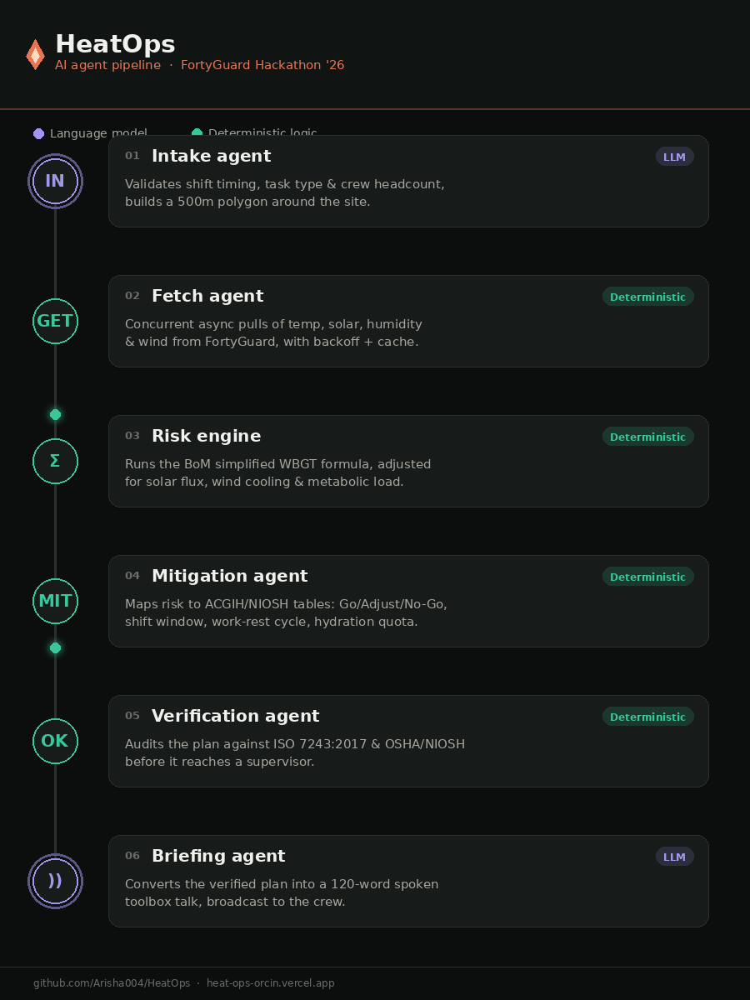

# HeatOps — Hyperlocal Occupational Thermal Safety & AI Risk Engine

[](https://www.iso.org/standard/66536.html)
[](https://www.osha.gov/heat-exposure)
[](https://threejs.org/)
[](https://supabase.com/)
[](https://ai.google.dev/)

> *"Your site runs 4.2 °C hotter than the municipal average and stays above safe limits for 6 straight hours. Adjust the shift to 05:30–11:00 to eliminate heat stroke risk and keep your entire 30-worker crew productive."*

---

##  Overview

**HeatOps** is an enterprise-grade occupational heat safety intelligence platform designed for construction supervisors, HSE directors, infrastructure contractors, and agricultural operations. 

It fuses **hyperlocal thermal microclimate data** (via FortyGuard API and real-world meteorological forecasts), **deterministic ISO 7243 / ACGIH WBGT risk calculation models**, and **Google Gemini AI agents** to deliver:
1. **Deterministic Go / Caution / No-Go Decisions** with shift window adjustments.
2. **Work-Rest & Hydration Schedules** calibrated to metabolic exertion.
3. **Interactive 3D WebGL Thermal Visualizers** (Thermal Globe, Microclimate Zone, ISO WBGT Station).
4. **Supervisor Toolbox Talks** (spoken English briefing).
5. **Instant ISO Compliance PDF Reports** for HSE audits and regulatory compliance.
6. **Multi-Crew SMS / WhatsApp Alert Dispatch** with cryptographically verifiable delivery tokens.

---

## Key Features

- **Hyperlocal Heat Modeling**: Urban Heat Island (UHI) delta analysis comparing site-level microclimates with city baselines.
- **Deterministic Risk Engine**:
  - Simplified Australian BoM / ISO 7243 Wet Bulb Globe Temperature (WBGT).
  - Metabolic workload offsets: Heavy Concrete Pouring (+2.5 °C), Asphalt Paving (+4.0 °C), Roofing (+3.5 °C), Excavation (+1.5 °C).
  - Unacclimatized worker and direct solar radiation corrections.
- **Multi-Agent Pipeline**:
  - `Intake`: Form validation and metabolic specification.
  - `Fetch`: Concurrent meteorological & FortyGuard microclimate ingestion.
  - `Risk`: Mathematical threshold exceedance & persistence scoring.
  - `Mitigation`: Dynamic shift windows, hydration rates, and work-rest ratios.
  - `Verify`: Deterministic sanity checks and compliance guardrails.
  - `Briefing`: 120-word spoken toolbox talks in English.
- **Durable Persistence**: Built-in Supabase Authentication & PostgreSQL persistence for site assessments.
- **3D Thermal Graphics**: Interactive Three.js WebGL rendering of temperature heat zones, infrared thermal shields, and ISO sensor stations.

---

##  Quick Start

### 1. Prerequisites
- Node.js 18+ or 20+
- npm or yarn

### 2. Installation
```bash
git clone https://github.com/Arisha004/HeatOps.git
cd heatops
npm install
```

### 3. Environment Setup
Copy the environment template:
```bash
cp .env.example .env
```

Configure your `.env` file:
```env
# Google Gemini API Key (for server-side AI reasoning & toolbox briefings)
GEMINI_API_KEY=your_gemini_api_key_here

# FortyGuard API Key 
FORTYGUARD_API_KEY=your_fortyguard_key_here
```

### 4. Running Locally
```bash
# Start development server (Port 3000)
npm run dev
```
Open [http://localhost:3000](http://localhost:3000) in your browser.

### 5. Production Build
```bash
# Compile client assets and server bundle
npm run build

# Start production server
npm start
```

---

##  Project Structure

```
heatops/
├── server.ts                 # Express backend + Vite middleware + Gemini AI endpoints
├── package.json              # Project dependencies and build scripts
├── metadata.json             # Applet metadata and permissions
├── AGENTS.md                 # Multi-agent pipeline architecture specification
├── .env.example              # Environment variables template
├── src/
│   ├── App.tsx               # Main application container & view orchestration
│   ├── main.tsx              # React DOM entry point
│   ├── types.ts              # Global TypeScript interfaces & ISO data contracts
│   ├── constants.ts          # Predefined industrial site presets & demo benchmarks
│   ├── index.css             # Tailwind CSS configuration
│   ├── components/
│   │   ├── Header.tsx        # Navigation header with logo home routing & telemetry
│   │   ├── Footer.tsx        # Enterprise footer with quick actions & regulatory specs
│   │   ├── LandingPage.tsx   # Visual landing page with interactive 3D thermal globe
│   │   ├── SetupScreen.tsx   # Site configuration & metabolic workload intake form
│   │   ├── DailyTimeline.tsx # 24-hour heat index & solar UV radiation visualizer
│   │   ├── VerdictAndStats.tsx# Go/No-Go decision matrix & ISO mitigation cards
│   │   ├── AiReasoningCard.tsx# Gemini thermal reasoning & spoken toolbox briefing
│   │   ├── SiteThermalZone3D.tsx# 3D isometric construction site thermal simulation
│   │   ├── ThermalGlobe3D.tsx # 3D rotating planetary thermal infrared globe
│   │   ├── WbgtStation3D.tsx # 3D ISO 7243 black-globe thermometer station
│   │   ├── HourDetailSheet.tsx# Detailed single-hour meteorological drilldown drawer
│   │   ├── IsoMathModal.tsx  # ISO 7243 mathematical formulas & threshold proofs
│   │   ├── NotificationModal.tsx# Crew WhatsApp/SMS emergency alert dispatch modal
│   │   ├── AuthModal.tsx     # Supabase contractor sign-in & role profile modal
│   │   ├── JudgeTourModal.tsx# Interactive guided walkthrough for hackathons & judges
│   │   ├── EdgeCaseBanners.tsx# Offline mode, low-confidence & partial data indicators
│   │   └── Logo.tsx          # HeatOps vector branding logo component
│   └── lib/
│       ├── supabase.ts       # Supabase client, auth sessions, and cloud sync
│       └── pdfReport.ts      # jsPDF export for printable OSHA / ISO safety audit sheets
```
---
## AI Agent Pipeline



HeatOps runs a deterministic 6-stage agent pipeline — zero hallucinated math, full regulatory traceability. Only Stages 1 and 6 touch an LLM (Gemini); the safety-critical math in between is fully deterministic, auditable, and reproducible.

| Stage | Agent | What it does |
|---|---|---|
| 01 | **Intake** (LLM + Geo Parser) | Validates shift parameters and crew headcount; builds a 500m bounding polygon around the site coordinates. |
| 02 | **Fetch** (Async Gateway) | Pulls concurrent FortyGuard telemetry — air temp, solar irradiance, humidity, wind vectors — with exponential backoff and cache dedup. |
| 03 | **Risk Engine** (Pure Math) | Runs the Australian BoM simplified WBGT formula, adjusted for solar flux, wind cooling, and metabolic load. |
| 04 | **Mitigation** (ACGIH/NIOSH Mapping) | Outputs the Go / Adjust / No-Go call, safe shift windows, work-rest cycles, and hydration quotas. |
| 05 | **Verification** (Safety Audit) | Cross-checks every recommendation against ISO 7243:2017 and OSHA/NIOSH criteria before it reaches a supervisor. |
| 06 | **Briefing** (Audio Synthesizer) | Converts the verified plan into a 120-word spoken toolbox talk, broadcast with 1-click synthetic speech. |

*Built for the FortyGuard Hyperlocal Heat Hackathon '26 — AI Agents track.*
---

## Testing & Verification

- **Lint Check**: `npm run lint`
- **TypeScript Build**: `npm run build`
- **Edge Case Modes**:
  - Test simulated sensor IoT data streaming (live toggle in top banner)
  - Test offline resilience (all calculations run locally with cached microclimate models)

---

##  License & Compliance
Built in compliance with **ISO 7243:2017** (*Hot environments — Estimation of heat stress on working man*), **ACGIH TLV** guidelines, and **NIOSH Criteria 2016-106** and **OSHA heat illness prevention guidance**.
